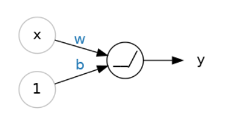
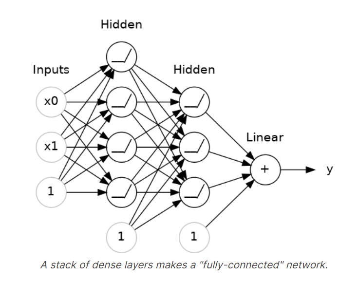
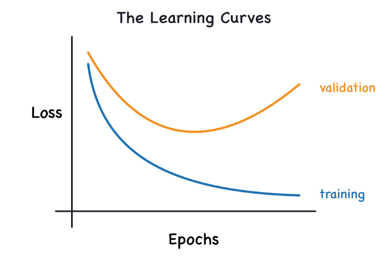
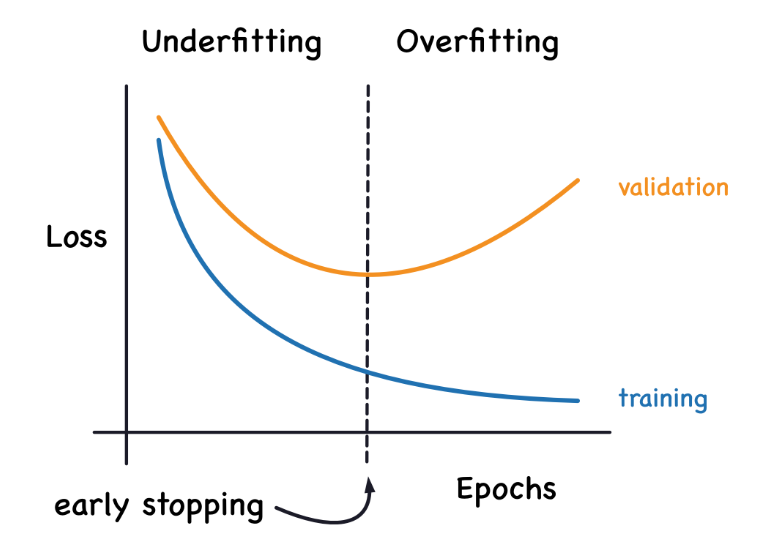
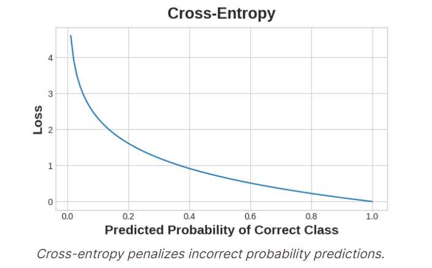
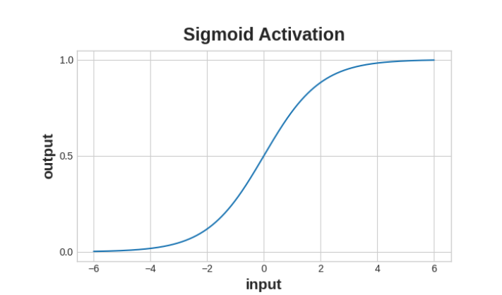

<style>
body {
    font-family: Arial, sans-serif;
}
</style>
# <u>Presentation of basic DL commands</u>
## <p style='color:blue'>1.Elementary commands to begin</p>
### 1.1.Elementary packages for DL: tensorflow
These packages will help us perform DL on datasets. 

```python
from tensorflow import keras
from tensorflow.keras import layers
```
### 1.2.The creation of a layer
```python
model = keras.Sequential([
    layers.Dense(units=1, input_shape=[3])
])
```
This bloc will allow us to create a model with only one neuron which is the final one (the *output*). The two arguments are <br>
> *units*: the number on neuron <br>
> *input_shape*: the dimension of the input <br>

## <p style='color:blue'>2.Deep Neural Network</p>
### 2.1.The activation function
We first need to define an **activation function**, it is useful since it'll allow us to depict non-linear relationships. The following is the **ReLu** function. <br>
<p align="center">
  
</p>
This function allows us not only to consider y = w.x + b but instead to consider:<br> 

> y = ReLu(w.x + b) 


<p align="center">
  
</p>

### 2.2.Stacking dense layers
<p align="center">
  
</p>
The code to build such a sequential model is written bellow. Note that we use **Sequential**
 <br>


 ```python
 model = keras.Sequential([
    # the hidden ReLU layers
    layers.Dense(units=4, activation='relu', input_shape=[2]),
    layers.Dense(units=3, activation='relu'),
    # the linear output layer 
    layers.Dense(units=1),
])
 ```

 ## <p style='color:blue'>3.How to actually *train* the network?</p>
 We need to introduce two new notions so that to perform a training:
 * A **"loss function"** that measures how good the network's predictions are.
 * An **"optimizer"** that can tell the network how to change its weights.

 ### 3.1.The loss function
 The loss function measures the disparity between the the target's true value and the value the model predicts. <br>
 A common loss function for regression problems is the mean absolute error or **MAE**. For each prediction y_pred, MAE measures the *disparity* from the true target y_true by an absolute difference abs(y_true - y_pred).

 ### 3.2 The Optimizer - Stochastic Gradient Descent
 We've described the problem we want the network to solve, but now we need to say how to solve it. This is the job of the optimizer. The optimizer is an algorithm that adjusts the weights to minimize the loss. <br>
 Virtually all of the optimization algorithms used in deep learning belong to a family called stochastic gradient descent. They are iterative algorithms that train a network in steps. One step of training goes like this:<br>
1. Sample some training data and run it through the network to make predictions.
2. **Measure** the loss between the predictions and the true values.
3. Finally, **adjust** the weights in a direction that makes the loss smaller.

> <u>Glossary:</u>
> Each iteration's sample of training data is called a **minibatch** 
> A complete round of the training data is called an **epoch**

### 3.3 Learning Rate and Batch Size
Notice that the line only makes a small shift in the direction of each batch (instead of moving all the way). The size of these shifts is determined by the **learning rate**. A smaller learning rate means the network needs to see more minibatches before its weights converge to their best values. <br>
The learning rate and the size of the minibatches are the two parameters that have the largest effect on how the SGD training proceeds. Their interaction is often subtle and the right choice for these parameters isn't always obvious. <br>
Fortunately, for most work it won't be necessary to do an extensive hyperparameter search to get satisfactory results. **Adam** is an SGD algorithm that has an adaptive learning rate that makes it suitable for most problems without any parameter tuning (it is "self tuning", in a sense). Adam is a great general-purpose optimizer. <br>

### 3.4 How to proceed?
We can add these parameters to the model with the following:
```python
model.compile(
    optimizer="adam",
    loss="mae",
)
```
Now, we want to fit the model:
```python
history = model.fit(
    X_train, y_train,
    validation_data=(X_valid, y_valid),
    batch_size=256,
    epochs=10,
)
```

## <p style='color:blue'>4.Overfitting and Underfitting</p>
Recall from the example in the previous lesson that Keras will keep a history of the training and validation loss over the epochs that it is training the model. In this lesson, we're going to learn how to interpret these learning curves and how we can use them to guide model development. In particular, we'll examine at the learning curves for evidence of underfitting and overfitting and look at a couple of strategies for correcting it. <br>

### 4.1. Interpreting the Learning Curves
You might think about the information in the training data as being of two kinds: **signal** and **noise**. The signal is the part that *generalizes*, the part that can help our model make predictions from *new* data. The noise is that part that is only true of the training data; the noise is all of the random fluctuation that comes from data in the *real-world* or all of the incidental, non-informative patterns that can't actually help the model make predictions. The noise is the part might look useful but really isn't. <br>

We train a model by choosing weights or parameters that minimize the loss on a training set. You might know, however, that to accurately assess a model's performance, we need to evaluate it on a new set of data, the validation data. (You could see our lesson on model validation in Introduction to Machine Learning for a review.)<br>

When we train a model we've been plotting the loss on the training set epoch by epoch. To this we'll add a plot the validation data too. These plots we call the learning curves. To train deep learning models effectively, we need to be able to interpret them. <br>

<p align="center">
  
</p>

This trade-off indicates that there can be two problems that occur when training a model: not enough signal or too much noise. **Underfitting** the training set is when the loss is not as low as it could be because the model hasn't learned enough signal. **Overfitting** the training set is when the loss is not as low as it could be because the model learned too much noise. The trick to training deep learning models is finding the best balance between the two.

### 4.2. Capacity

A model's **capacity** refers to the size and complexity of the patterns it is able to learn. For neural networks, this will largely be determined *by how many neurons* it has and *how* they are connected together. If it appears that your network is underfitting the data, you should try *increasing* its capacity. <br>

> You can increase the capacity of a network either by making it wider (more units to existing layers) or by making it deeper (adding more layers). **Wider** networks have an easier time learning more linear relationships, while **deeper** networks prefer more nonlinear ones. Which is better just depends on the dataset.

```python
model = keras.Sequential([
    layers.Dense(16, activation='relu'),
    layers.Dense(1),
])

wider = keras.Sequential([
    layers.Dense(32, activation='relu'),
    layers.Dense(1),
])

deeper = keras.Sequential([
    layers.Dense(16, activation='relu'),
    layers.Dense(16, activation='relu'),
    layers.Dense(1),
])
```

### 4.3. Early Stopping

We mentioned that when a model is too eagerly learning noise, the validation loss may start to increase during training. To prevent this, we can simply stop the training whenever it seems the validation loss isn't decreasing anymore. Interrupting the training this way is called **early stopping**.

<p align="center">
  
</p>

Once we detect that the validation loss is starting to rise again, we can reset the weights back to where the minimum occured. This ensures that the model won't continue to learn noise and overfit the data. <br>

Training with early stopping also means we're in less danger of stopping the training too early, before the network has finished learning signal. So besides preventing overfitting from training too long, early stopping can also prevent underfitting from not training long enough. Just set your training epochs to some large number (more than you'll need), and early stopping will take care of the rest. <br>

Now let's consider a complete example:
```python
from tensorflow import keras
from tensorflow.keras import layers, callbacks

early_stopping = callbacks.EarlyStopping(
    min_delta=0.001, # minimium amount of change to count as an improvement
    patience=20, # how many epochs to wait before stopping
    restore_best_weights=True,
)

model = keras.Sequential([
    layers.Dense(512, activation='relu', input_shape=[11]),
    layers.Dense(512, activation='relu'),
    layers.Dense(512, activation='relu'),
    layers.Dense(1),
])
model.compile(
    optimizer='adam',
    loss='mae',
)
history = model.fit(
    X_train, y_train,
    validation_data=(X_valid, y_valid),
    batch_size=256,
    epochs=500,
    callbacks=[early_stopping], # put your callbacks in a list
    verbose=0,  # turn off training log
)
```


## <p style='color:blue'>5.Dropout and Batch Normalization</p>

There's more to the world of deep learning than just dense layers. There are dozens of kinds of layers you might add to a model. (Try browsing through the Keras docs for a sample!) Some are like dense layers and define connections between neurons, and others can do preprocessing or transformations of other sorts.

### 5.1.Dropout
The first of these is the "dropout layer", which can help **correct** overfitting.<br>

In the last lesson we talked about how overfitting is caused by the network learning *spurious patterns in the training data*. To recognize these spurious patterns a network will often rely on very a specific combinations of weight, a kind of "conspiracy" of weights. Being so specific, they tend to be fragile: remove one and the conspiracy falls apart. <br>

This is the idea behind dropout. To break up these conspiracies, we randomly drop out some fraction of a layer's input units every step of training, making it much harder for the network to learn those spurious patterns in the training data. Instead, it has to search for broad, general patterns, whose weight patterns tend to be more robust. <br>

```python
keras.Sequential([
    # ...
    layers.Dropout(rate=0.3), # apply 30% dropout to the next layer
    layers.Dense(16),
    # ...
])
```
### 5.2.Batch Normalization

The next special layer we'll look at performs **"batch normalization"** (or "batchnorm"), which can help correct training that is slow or unstable. <br>
Now, if it's good to normalize the data before it goes into the network, maybe also normalizing inside the network would be better! In fact, we have a special kind of layer that can do this, the batch normalization layer. A batch normalization layer looks at each batch as it comes in, first normalizing the batch with its own mean and standard deviation, and then also putting the data on a new scale with two trainable rescaling parameters. Batchnorm, in effect, performs a kind of coordinated rescaling of its inputs. <br>

Most often, batchnorm is added as an aid to the optimization process (though it can sometimes also help prediction performance). Models with batchnorm tend to need fewer epochs to complete training. Moreover, batchnorm can also fix various problems that can cause the training to get "stuck". Consider adding batch normalization to your models, especially if you're having trouble during training.

## <p style='color:blue'>6.Binary classification</p>

So far in this course, we've learned about how neural networks can solve regression problems. Now we're going to apply neural networks to another common machine learning problem: classification. Most everything we've learned up until now still applies. The main difference is in the loss function we use and in what kind of outputs we want the final layer to produce.

### 6.1.Accuracy and Cross-Entropy
Accuracy is one of the many metrics in use for measuring success on a classification problem. Accuracy is the ratio of correct predictions to total predictions: 
> accuracy = number_correct / total
 A model that always predicted correctly would have an accuracy score of 1.0. All else being equal, accuracy is a reasonable metric to use whenever the classes in the dataset occur with about the same frequency. <br>

The problem with accuracy (and most other classification metrics) is that it can't be used as a loss function. SGD needs a loss function that changes **smoothly**, but accuracy, being a ratio of counts, changes in "jumps". So, we have to choose a substitute to act as the loss function. This substitute is the **cross-entropy function**. <br>

Now, recall that the loss function defines the objective of the network during training. With regression, our goal was to **minimize** the distance between the *expected* outcome and the *predicted* outcome. We chose *MAE* to measure this distance. <br>

For *classification*, what we want instead is a distance between probabilities, and this is what **cross-entropy** provides. Cross-entropy is a sort of measure for the distance from one probability distribution to another. <br>

<p align="center">
  
</p>

### 6.2.Making Probabilities with the Sigmoid Function
The cross-entropy and accuracy functions both require *probabilities* as **inputs**, . To covert the real-valued outputs produced by a dense layer into probabilities, we attach a new kind of activation function, the sigmoid activation. <br>

To get the *final class prediction*, we define a **threshold** probability. Typically this will be **0.5**, so that rounding will give us the correct class: below 0.5 means the class with label 0 and 0.5 or above means the class with label 1. A 0.5 threshold is what Keras uses by default with its accuracy metric.

<p align="center">
  
</p>

### 6.3.A comprehensive example

```python
from tensorflow import keras
from tensorflow.keras import layers

model = keras.Sequential([
    layers.Dense(4, activation='relu', input_shape=[33]),
    layers.Dense(4, activation='relu'),    
    layers.Dense(1, activation='sigmoid'),
])
model.compile(
    optimizer='adam',
    loss='binary_crossentropy',
    metrics=['binary_accuracy'],
)
early_stopping = keras.callbacks.EarlyStopping(
    patience=10,
    min_delta=0.001,
    restore_best_weights=True,
)

history = model.fit(
    X_train, y_train,
    validation_data=(X_valid, y_valid),
    batch_size=512,
    epochs=1000,
    callbacks=[early_stopping],
    verbose=0, # hide the output because we have so many epochs
)
```